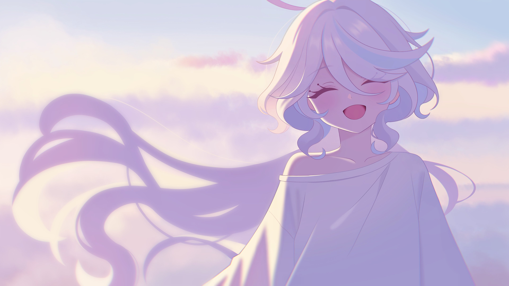

<div align="center">


<br>


<br>

# 🌊 𝐑𝐍𝐆 𝐒𝐅 🌊

*"Sometimes the calmest ocean hides the deepest feelings."*



</div>

# 🌸 𝑨𝒃𝒐𝒖𝒕

> *"Not every story needs a perfect ending."*

Selamat datang.

Kalau kamu sedang membaca ini, terima kasih sudah meluangkan waktu untuk mampir.

Repository ini bukan hanya tempat menyimpan project.

Di sini ada proses belajar, rasa penasaran, kesalahan, kegagalan, dan sedikit demi sedikit perkembangan.

Semoga ada sesuatu yang bisa kamu temukan di sini.

---

# 🌊 𝑾𝒉𝒐 𝑨𝒎 𝑰

```yaml
Name      : Rangga Sofyanto
Country   : Indonesia 🇮🇩
Nickname  : RNG SF
Favorite  : Furina 💙
Learning  : JavaScript • NodeJS • Automation
```

---

# 🌸 𝑷𝒆𝒔𝒂𝒏 𝑫𝒂𝒓𝒊𝒌𝒖 𝑼𝒏𝒕𝒖𝒌 𝑴𝒖

> ### 🌷 Musuh terbesar kita bukan selalu orang lain.

Kadang...

Musuh terbesar kita adalah **harapan**.

Berharap kepada seseorang yang bahkan tidak pernah menjanjikan apa pun.

Lalu kecewa karena kenyataan tidak sesuai dengan yang kita bayangkan.

Sedangkan ego...

Membuat kita tetap bertahan pada sesuatu yang sebenarnya sudah selesai.

Belajarlah melepaskan.

Karena tidak semua yang pergi harus dikejar.

Dan tidak semua yang hilang harus kembali.

---

> ### 🌊 Untukmu...

Kalau hari ini terasa berat...

Istirahatlah.

Tidak apa-apa.

Tidak ada yang salah dengan berhenti sebentar.

Minumlah air.

Tarik napas.

Lihat langit.

Besok masih ada.

Dan kamu masih punya banyak kesempatan.

> **Pelan bukan berarti berhenti.**

---

<div align="center">

<img
